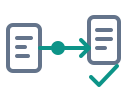

<p></p>

# BindWitness

[](https://github.com/0then0/bindwitness/actions/workflows/ci.yml)
[](go.mod)
[](LICENSE)
[](#supported-environments)

**Verify which shared object actually provides your native symbols.**

BindWitness is a small CLI for regression testing selected ELF symbol bindings
in a trusted smoke workload. It runs the real glibc loader, records
`LD_DEBUG=bindings,files` diagnostics, and checks an explicit JSON contract.
Use it when changing native dependencies, plugin loading order, or a Python
native extension's environment. A smoke test can produce the same output while
binding to the wrong library; BindWitness checks the provider itself.

Version 0.1 uses only the Go standard library. A C compiler is needed for the
included test fixtures, not for running the CLI.

## Supported environments

Capture is validated on Linux ARM64 with **glibc 2.36 and 2.41**. Other glibc
versions return `UNRESOLVED` until their diagnostic format is validated. Offline
`check` and `compare` are also tested on macOS ARM64.

The capture scope is one process in the base linker namespace, with immutable
artifacts and no unload/reload cycles. Use **absolute paths for selected shared
objects**: the loader's relative DSO names do not establish which working
directory was used to load them. The executable's original argv[0] is preserved
and can be relative. See [capture limitations](docs/report-format.md#capture-limitations).

Native capture on macOS, Windows, musl, Mach-O and PE is outside v0.1. BindWitness
does not perform general ABI analysis or predict unexecuted paths.

## Quick start

Prebuilt Linux ARM64 binaries are available from [GitHub Releases](https://github.com/0then0/bindwitness/releases).
Download the archive and `SHA256SUMS`, and verify the checksum before extracting.

Clone the repository and build with Go 1.25 or newer:

```sh
git clone https://github.com/0then0/bindwitness.git
cd bindwitness
mkdir -p build
CGO_ENABLED=0 go build -trimpath -o build/bindwitness ./cmd/bindwitness
```

On supported Linux, build the demonstration with GCC or Clang and check it:

```sh
sh scripts/build-fixtures.sh
./build/bindwitness check --config examples/native.json --report build/check.json
```

Expected result: `PASS`, exit 0. Two plugins export `shared_value`, and the
consumer must bind to logical object `a`. The fixture host resolves its library
arguments to absolute paths before loading them.

Run the full demonstration:

```sh
python3 scripts/native-validation.py build/bindwitness build/demo
```

Reversing plugin order still prints `result=12`, but produces `FAIL` with the
binding to `b` as its witness. The script also checks missing coverage, saved
observations and comparison; it exits 0 when all expected outcomes are obtained.

For your application, start from [examples/native.json](examples/native.json)
and follow the [configuration guide](docs/configuration.md). Run a dynamic ELF
executable directly; for a script, explicitly name its ELF interpreter.

## Commands

Every operation requires `--config` and `--report`. The report directory must
already exist.

```sh
# Save evidence. This does not enforce the binding contract.
./build/bindwitness capture --config examples/native.json --report build/capture.json

# Capture and check the selected bindings.
./build/bindwitness check --config examples/native.json --report build/check.json

# Check saved evidence without executing the workload or reading its artifacts.
./build/bindwitness check --config examples/native.json \
  --observation build/capture.json --report build/offline.json

# Compare two observations using explicit logical object mappings.
./build/bindwitness compare --config examples/compare.json \
  --left build/demo/native-positive.json --right build/demo/native-mismatch.json \
  --report build/compare.json
```

A saved `check` report can also be passed to `--observation`, `--left` or `--right`.
Compare uses exact reference, symbol and trace version. It distinguishes a
provider change from a rebuild of the same logical provider and from missing
observations. See [comparison configuration](docs/configuration.md#comparison).

## CI outcomes

- **0 / PASS:** required bindings were observed and met the contract with
  sufficient, supported evidence. For `capture`, this means capture conditions
  held; the contract has not been checked.
- **1 / FAIL:** a concrete provider change, disallowed provider or exact artifact
  pin mismatch was observed.
- **2 / UNRESOLVED:** coverage or evidence is insufficient, including truncation,
  ambiguous identity, unsupported scope, deadline or cancellation.
- **3 / INFRASTRUCTURE_ERROR:** invalid input, unsupported report version, launch
  failure, harness error or failure to save the mandatory report.

A valid violation remains FAIL even if later diagnostics are incomplete. The
report retains both findings. A normal nonzero workload exit code is recorded
separately; CI can also gate on `observation.workload.exit_code`.

Missing observations are not provider-change witnesses. In compare, unequal
provider sets sharing a provider indicate unmatched coverage and return
UNRESOLVED. A successful comparison describes the declared observed scope,
not complete program equivalence.

## Evidence

Reports include bounded raw trace lines, binding events, file identities and
provenance. Every event retains the loader's reference/provider names, raw symbol,
trace version, namespace IDs and its source line. The terminal shows the first
actionable witness; JSON preserves the full evidence.

Identity includes resolved path, SHA-256, ELF class/machine, and SONAME/build ID
when available. Objects are never merged solely by basename, SONAME or hash.
Pre/post checks detect available signs of artifact changes. Hashes describe files
read from disk; they do not prove mapped bytes or detect every change followed by
restoration. Workloads and saved reports are trusted developer inputs.

See [report format and limitations](docs/report-format.md) and the versioned
[contract](docs/config.schema.json), [comparison](docs/compare.schema.json) and
[report](docs/report.schema.json) schemas.

## Testing and releases

The [validation guide](docs/validation.md) explains Linux containers, race and
fuzz checks, installed/release binaries, real CPython/zlib validation and release
packaging. [GitHub Actions](.github/workflows/ci.yml) uses the same scripts.

[testdata](testdata/README.md) is part of the test suite: it contains C source
fixtures, real loader traces and representative reports with provenance. Keep it
in source checkouts. Generated binaries and new validation runs belong in
ignored `build/` and `dist/` directories.

## Related tools

Runtime binding analysis has existed for decades. BindWitness provides a small
contract workflow for selected bindings of an actual workload.

- [libtree](https://github.com/haampie/libtree) explains dependency trees and library resolution.
- [Libabigail abicompat](https://sourceware.org/libabigail/manual/abicompat.html)
  checks ABI compatibility, including information beyond runtime bindings.
- [abicheck deps](https://abicheck.github.io/abicheck/user-guide/choose-your-workflow/)
  examines dependency resolution and compares dependency stacks.
- [ldaudit-yaml](https://github.com/buildsi/ldaudit-yaml) captures loader audit events;
  [latrace](https://github.com/jkkm/latrace) traces library calls through the audit interface.
- [Solaris lari](https://docs.oracle.com/cd/E19253-01/816-5165/6mbb0m9j3/index.html)
  analyzes runtime interfaces and saved linker bindings.
- [MONDO](https://www.cs.unm.edu/~donour/prof/PythonDC.pdf) monitors dynamic linking
  using loader traces and a graphical interface.

BindWitness v0.1 uses ordinary glibc diagnostics, with no custom loader or
`LD_AUDIT` module. Binding events are not call counts, call stacks, proven dlsym
callers or final IFUNC execution addresses.

## Motivation

[LLVM/LLDB PR #204710](https://github.com/llvm/llvm-project/pull/204710) discusses
ELF interposition involving duplicated HostInfoBase code.
[ROCm/AITER issue #4585](https://github.com/ROCm/aiter/issues/4585) describes HIP
symbols resolving to an earlier global TileLang stub.
[Compress::Raw::Zlib issue #8](https://github.com/pmqs/Compress-Raw-Zlib/issues/8)
and [PR #11](https://github.com/pmqs/Compress-Raw-Zlib/pull/11) discuss zlib symbol
collisions and prefixed bundled exports. These are upstream motivations; the
included fixtures do not claim to reproduce those bugs.

## License

[Apache License 2.0](LICENSE).
